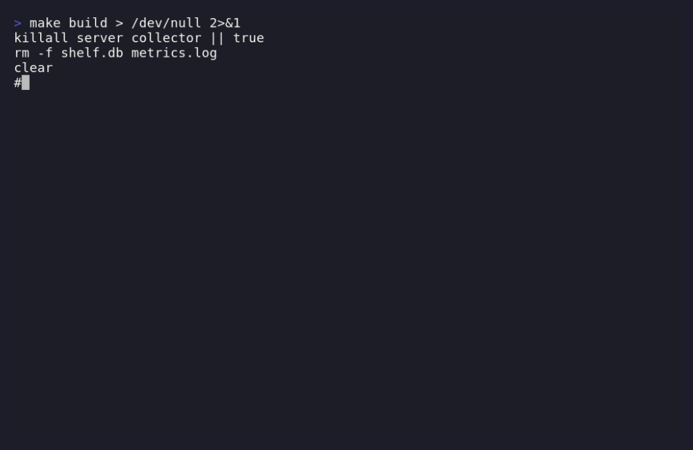

<div align="center">
  <h1>Shelf 🗄️</h1>
  <p><b>The zero-dependency, <35MB KV store and observability stack for Go.</b></p>
</div>

---

## The Problem
Running **Redis** for state and **Prometheus** for metrics on a single node, an IoT edge device, or a small indie project is massive overkill. It wastes RAM, requires complex deployments, and pulls in heavy external dependencies.

## The Solution
**Shelf** is a production-grade, persistent Key-Value store and time-series metrics pipeline built in pure Go. It requires **zero external dependencies** and runs the entire stack in under 35MB of RAM.

### Live Demo (The `top` Dashboard)

*(You can run this right now by typing: `docker compose run --rm top`)*

---

## Quick Start (2 Minutes)

You can run the entire Shelf cluster (KV Server, Metrics Collector, and Query API) using Docker Compose.

```bash
# 1. Clone the repo
git clone https://github.com/yourusername/shelf.git
cd shelf

# 2. Start the cluster (Server, Collector, Query API)
docker compose up -d --build

# 3. Write some data
curl -X PUT localhost:8080/keys/my-key -d '{"value":"SGVsbG8gV29ybGQ="}'

# 4. Open the live telemetry dashboard
docker compose run --rm top
```

---

## Why this exists

I built Shelf because I was tired of reaching for a 2GB observability and state stack for projects that could easily run on a Raspberry Pi or a $5 DigitalOcean droplet. 

Shelf proves that you can have strong durability (Write-Ahead Logs, Snapshots) and rich operational visibility (Prometheus-format metrics, rate/sum queries, live dashboards) using **just the Go standard library**.

## Who is this for?

- **Indie Hackers:** You want a complete backend stack that runs on a single cheap VPS.
- **Edge / IoT Developers:** You need persistence and telemetry on low-power devices.
- **Go Minimalists:** You believe in the power of the standard library and hate supply-chain bloat (`go.mod` with zero dependencies).

---

## Architecture

Shelf is composed of 4 independent, tiny binaries that work together:

| Binary | Purpose | RAM | CPU |
|---|---|---|---|
| **server** | Persistent KV store with HTTP API | ~10 MB | < 0.1 cores |
| **collector** | Scrapes `/metrics` → append-only log | < 5 MB | < 0.01 cores |
| **query** | HTTP query API (with memory retention limits) | < 20 MB | < 0.1 cores |
| **top** | Live terminal UI for node health | < 5 MB | < 0.01 cores |

**Total system: < 35 MB RAM, < 0.25 CPU cores.** (vs Prometheus at 1-4 GB RAM).

---

## Real Usage Examples

### 1. Interacting with the KV Store
Shelf uses a standard REST API. Values must be base64-encoded to safely support binary data.

```bash
# Set a key
curl -X PUT localhost:8080/keys/config -d '{"value":"dHJ1ZQ=="}'

# Get a key
curl localhost:8080/keys/config

# Check store size
curl localhost:8080/size
```

### 2. Querying Telemetry
The `query` API parses the append-only logs in memory and supports PromQL-lite queries.

```bash
# Get the current QPS over the last 5 minutes
curl 'localhost:9090/query?q=rate(shelf_http_requests_total[5m])'

# Get the total number of keys in the database
curl 'localhost:9090/query?q=shelf_store_size'
```

### 3. As an Embedded Go Library
You don't have to use the HTTP API. You can embed the Shelf storage engine directly into your own Go apps.

```go
import "shelf"

func main() {
    // Open DB with 16 shards and auto-snapshotting every 10,000 writes
    store, _ := shelf.Open("./data", 16, 10000)
    defer store.Close()

    store.Set("name", []byte("Alice"))
    value, _ := store.Get("name")
}
```

---

## Configuration & Guardrails

Shelf is designed not to crash your node. It includes built-in limits for memory and disk:

*   **Bounded Memory:** The Query API uses `-retention 24h` by default to automatically evict old metrics from RAM.
*   **Bounded Disk:** The Collector checks `max_size_mb` in `targets.json` and automatically truncates `metrics.log` if it grows too large.
*   **Durability:** The KV store defaults to high-throughput (sync on close), but you can pass `-sync-writes` for strict `fsync`-per-write durability.

---

## Contributing

We love contributions! Whether it's a bug fix, a new query aggregation, or documentation.
Please read our [Contributing Guide](CONTRIBUTING.md) to get started.

## License
MIT
